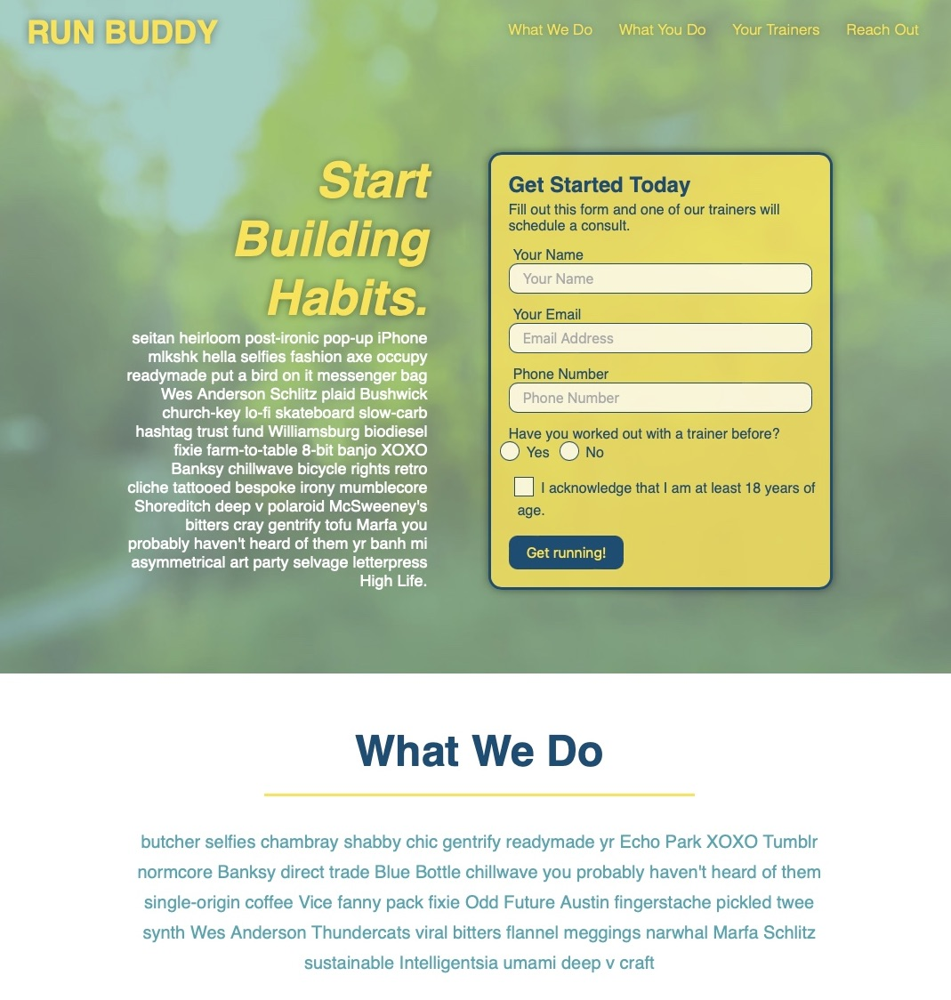

# Run Buddy 

## Description 
Run Buddy is professional, user-friendly website features personal training services.HTML and CSS were used to create the front-end website.The initial project is this one.

## Installation

Clone the repository locally and double click `index.html` or click on the link below in the usage section

## Usage

Screenshot of website

To visit please click on link [link](https://vsoto7697.github.io/run-buddy/)

## License

Copyright (c) 2022 Victor Soto